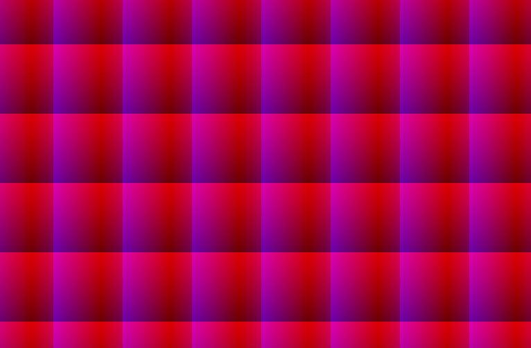

# About



Small base crate to use when you want to GPU-compute something in rust, using
vulkan, in a way that allows you to profile stuff using ngfx. I use compute
shaders to render to a texture as opposed to using a regular render pipeline
and render a fullscreen quad.

This a personal project.

# Running the example

```bash
cargo run --example compute
```

# Linting

```bash
# Is pedantic about stuff, but also disables some obnoxious lints.
cargo lint
```

# Current TODOs:

- [x] Add readme
- [ ] Profile an empty renderloop using compute shaders vs an empty renderloop using fragment shaders
- [ ] Remove all non-compute shader stuff
- [x] Create mini-demo
- [x] Make it debuggable using ngfx (kinda done?)
- [ ] Use host_cached memory and flushes instead of _hoping_ that coherent writes work fine
- [ ] Figure out why the nvidia ngfx shader debugger ignores the google-line directive, offsetting the GLSL code by ~5 lines.....
